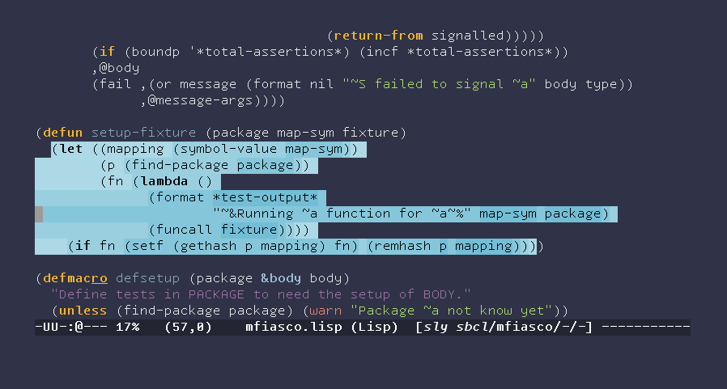

# A portable Common Lisp stepper interface

`sly-stepper` is contrib for [SLY, a Common Lisp IDE][sly].

It's the program that accompanies the [paper accepted to the European
Lisp Symposium 2020 Zurich][paper].

Need a decent README, but here's how to get started.

First, install it as described below.

Once that's done, and your SLY is connected, you can `M-x sly-stepper`
on any old function to *instrument it for stepping*.  



Intrumenting means setting [_stickers_][stickers] on every evaluated
form of the function.  Read about [SLY sticker usage][stickers] or
read the [paper][paper] on various ways in which you can step through
a function.

For convenience, the `M-x sly-stepper` is also bound to `C-c C-s P`.
If you make a mistake and set stickers you didn't mean to, you can
clear stickers for the whole defun do with `C-u C-c C-s C-s`, as
usual.

## Normal install

Since this is an external contrib with both Elisp and Lisp parts,
merely loading the Elisp into Emacs will have little effect. The
contrib has to be registered in SLY's `sly-contribs` variable for SLY
to take care of loading the Lisp side on demand.

For convenience, the `sly-stepper-autoloads` file takes care of this
automatically.  This means the following lines in your `~/.emacs` or
`~/.emacs.d/init/el` init file should be enough:

```elisp
;;; regular SLY setup
(setq inferior-lisp-program "/path/to/your/preferred/lisp")
(add-to-list 'load-path "/path/to/sly")
(require 'sly-autoloads)

(add-to-list 'load-path "/path/to/sly-stepper")
(require 'sly-stepper-autoloads)
```

In case you already have SLY loaded and running, you might have to
`M-x sly-setup` and `M-x sly-enable-contrib` to enable it.

## MELPA install

MELPA installs are not available right now.  If you're really
interested in making this a MELPA package, it's not hard, but needs a
bit of work.  Let me know in the issue tracker.

[sly]: https://github.com/capitaomorte/sly
[stickers]: https://joaotavora.github.io/sly/#Stickers
[paper]: https://zenodo.org/record/3742759
